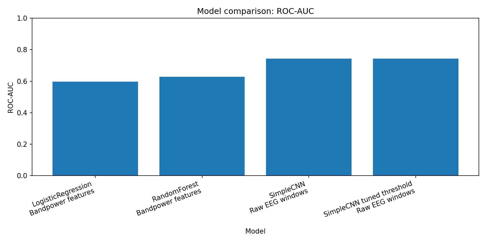
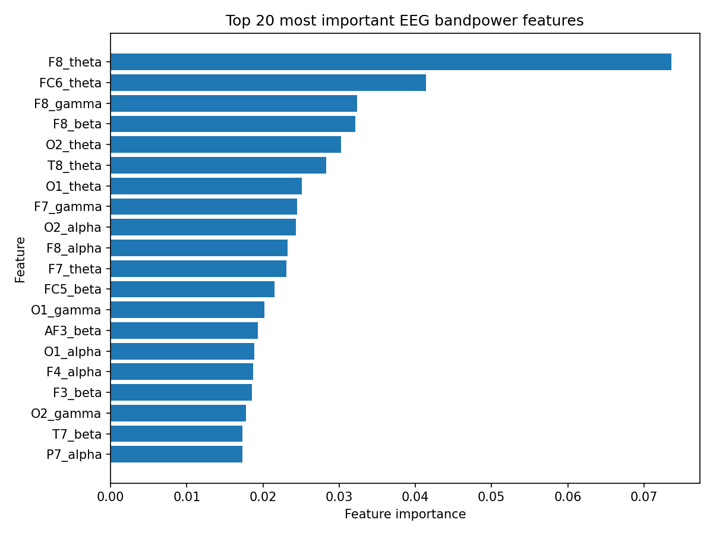

# \# EEG Cognitive Load Detection

# 

# A machine learning project for detecting cognitive load from EEG signals using spectral features and classical ML models.

# 

# The project is built as a portfolio-ready neurotechnology / BCI case study: data preparation, exploratory EEG analysis, feature extraction, baseline models, model evaluation and feature importance analysis.

# 

# \## Project goal

# 

# The goal is to classify EEG windows into two cognitive load states:

# 

# \- `0` — low cognitive load

# \- `1` — high cognitive load

# 

# The current version focuses on a window-level baseline using bandpower features and classical machine learning models.

# 

# \## Dataset

# 

# The project uses the STEW EEG workload dataset from Hugging Face.

# 

# Dataset characteristics used in this project:

# 

# \- 28,512 EEG windows

# \- 14 EEG channels

# \- 256 time points per window

# \- Sampling rate: 128 Hz

# \- Binary labels: low / high cognitive load

# \- Balanced classes:

# &#x20; - class 0: 14,256 windows

# &#x20; - class 1: 14,256 windows

# 

# Input tensor shape:

# 

# ```python

# X.shape == (28512, 14, 256)

# y.shape == (28512,)


EEG channels


The dataset contains 14 EEG channels:


AF3, F7, F3, FC5, T7, P7, O1,

O2, P8, T8, FC6, F4, F8, AF4

Methodology


The project pipeline includes:


Dataset loading

Data conversion to NumPy format

Exploratory EEG analysis

EEG signal visualization

Power spectral density analysis

Bandpower feature extraction

Classical ML baseline training

Cross-validation evaluation

Confusion matrix analysis

Feature importance analysis

Feature extraction


Spectral bandpower features were extracted for each EEG channel.


Frequency bands:


Band	Frequency range

Theta	4-8 Hz

Alpha	8-13 Hz

Beta	13-30 Hz

Gamma	30-45 Hz


For each EEG window:


14 channels x 4 frequency bands = 56 features

Models


Two baseline models were evaluated:


Logistic Regression

Random Forest


Validation setup:


5-fold stratified window-level cross-validation

Metrics:

Accuracy

Balanced Accuracy

Macro F1

Weighted F1

ROC-AUC


Note: the current version uses window-level cross-validation. Subject-independent validation is planned as the next stage when true subject IDs are available.


Results

Model	Accuracy	Balanced Accuracy	Macro F1	Weighted F1	ROC-AUC

Logistic Regression	0.715 +/- 0.006	0.715 +/- 0.006	0.714 +/- 0.006	0.714 +/- 0.006	0.783 +/- 0.005

Random Forest	0.902 +/- 0.003	0.902 +/- 0.003	0.902 +/- 0.003	0.902 +/- 0.003	0.962 +/- 0.003


The Random Forest model significantly outperformed Logistic Regression, suggesting that the relationship between EEG spectral features and cognitive load is non-linear.


Feature importance


Random Forest feature importance was used to analyze which channel-band combinations contributed most to the classification.


Top features included:


Feature	Importance

F8\_theta	0.07363

FC6\_theta	0.04138

F8\_gamma	0.03234

F8\_beta	0.03210

O2\_theta	0.03021

T8\_theta	0.02829

O1\_theta	0.02513

F7\_gamma	0.02449

O2\_alpha	0.02431

F8\_alpha	0.02319


The strongest features were mainly located in frontal and temporal channels, especially in the theta band.


This analysis should be interpreted as model-level feature importance, not as a causal neuroscientific conclusion.


Generated figures


Exploratory analysis:


reports/figures/class\_balance.png

reports/figures/eeg\_window\_class\_0.png

reports/figures/eeg\_window\_class\_1.png

reports/figures/psd\_by\_class.png


Model evaluation:


reports/figures/baseline\_metric\_comparison.png

reports/figures/random\_forest\_confusion\_matrix.png


Feature importance:


reports/figures/top20\_feature\_importance.png

reports/figures/channel\_importance.png

reports/figures/band\_importance.png

reports/figures/channel\_band\_importance\_heatmap.png

Project structure

eeg-cognitive-load-detection/

│

├── app/

├── data/

│   ├── raw/

│   └── processed/

│

├── notebooks/

├── reports/

│   ├── figures/

│   ├── baseline\_fast\_cv\_results.csv

│   ├── baseline\_fast\_summary.csv

│   ├── feature\_importance.csv

│   └── results.md

│

├── scripts/

│   ├── check\_dataset.py

│   ├── check\_processed.py

│   ├── prepare\_stew.py

│   ├── explore\_data.py

│   ├── train\_baseline\_fast.py

│   ├── plot\_baseline\_results.py

│   └── analyze\_feature\_importance.py

│

├── src/

│   ├── data/

│   │   └── load\_stew.py

│   └── features/

│       └── bandpower.py

│

├── requirements.txt

└── README.md

Installation


Create and activate virtual environment:


python -m venv .venv


Windows PowerShell:


.\\.venv\\Scripts\\Activate.ps1


Install dependencies:


pip install -r requirements.txt

Reproduce results


Prepare dataset:


python scripts/prepare\_stew.py


Run exploratory analysis:


python scripts/explore\_data.py


Train baseline models:


python scripts/train\_baseline\_fast.py


Generate baseline plots and report:


python scripts/plot\_baseline\_results.py


Analyze feature importance:


python scripts/analyze\_feature\_importance.py

Current limitations


The current version uses window-level cross-validation. This is useful as a first baseline, but it may overestimate generalization performance because windows from the same participant can be similar.


Next project stage:


obtain true subject IDs from the raw STEW dataset

implement GroupKFold / Leave-One-Subject-Out validation

compare window-level and subject-independent results

add a simple neural network baseline

add a Streamlit demo

Tech stack

Python

NumPy

Pandas

SciPy

scikit-learn

Matplotlib

Hugging Face Datasets

MNE

<!-- VALIDATION_COMPARISON_START -->

## Window-level vs subject-independent validation

A key part of this project is comparing two validation strategies on the same Kaggle STEW binary dataset.

EEG windows from the same subject are often highly correlated. If windows from the same person appear in both train and test sets, the model may learn subject-specific patterns instead of general cognitive load patterns.

For this reason, subject-independent validation is a more realistic test of generalization to unseen people.

### Validation strategies

| Strategy | Description |
|---|---|
| Window-level CV | Random stratified split of EEG windows. The same subjects can appear in both train and test. |
| Subject-independent CV | Grouped split by subject. Test subjects are unseen during training. |

### Results

| Validation | Model | Accuracy | Balanced Accuracy | Macro F1 | ROC-AUC |
|---|---|---:|---:|---:|---:|
| Window-level CV | LogisticRegression | 0.705 +/- 0.018 | 0.695 +/- 0.019 | 0.678 +/- 0.024 | 0.812 +/- 0.017 |
| Window-level CV | RandomForest | 0.949 +/- 0.003 | 0.948 +/- 0.003 | 0.949 +/- 0.003 | 0.990 +/- 0.001 |
| Subject-independent CV | LogisticRegression | 0.616 +/- 0.041 | 0.585 +/- 0.080 | 0.550 +/- 0.112 | 0.597 +/- 0.106 |
| Subject-independent CV | RandomForest | 0.594 +/- 0.077 | 0.580 +/- 0.099 | 0.567 +/- 0.110 | 0.628 +/- 0.142 |

### Interpretation

Window-level cross-validation gives much higher performance, especially for Random Forest.
However, this setup allows subject overlap between train and test folds.

Subject-independent validation is substantially harder and gives lower, more realistic performance.
This suggests that a large part of the window-level performance is likely driven by subject-specific EEG patterns rather than fully generalizable cognitive load markers.

### Generated figures

- `reports/figures/validation_comparison_accuracy.png`
- `reports/figures/validation_comparison_balanced_accuracy.png`
- `reports/figures/validation_comparison_macro_f1.png`
- `reports/figures/validation_comparison_roc_auc.png`

<!-- VALIDATION_COMPARISON_END -->

<!-- FINAL_RESULTS_START -->

## Final results and key findings

This project evaluates EEG cognitive load detection under both optimistic and realistic validation settings.

The most important result is not only the model score, but the difference between window-level and subject-independent validation.

### Window-level vs subject-independent validation

| Validation | Model | Accuracy | Balanced Accuracy | Macro F1 | ROC-AUC |
|---|---|---:|---:|---:|---:|
| Subject-independent CV | LogisticRegression | 0.616 +/- 0.041 | 0.585 +/- 0.080 | 0.550 +/- 0.112 | 0.597 +/- 0.106 |
| Subject-independent CV | RandomForest | 0.594 +/- 0.077 | 0.580 +/- 0.099 | 0.567 +/- 0.110 | 0.628 +/- 0.142 |
| Window-level CV | LogisticRegression | 0.705 +/- 0.018 | 0.695 +/- 0.019 | 0.678 +/- 0.024 | 0.812 +/- 0.017 |
| Window-level CV | RandomForest | 0.949 +/- 0.003 | 0.948 +/- 0.003 | 0.949 +/- 0.003 | 0.990 +/- 0.001 |

Window-level validation gives much higher scores because EEG windows from the same subject can appear in both train and test sets.

Subject-independent validation is harder and more realistic because the model is tested on unseen subjects.


### Classical ML vs CNN

| Model | Input | Validation | Accuracy | Balanced Accuracy | Macro F1 | ROC-AUC |
|---|---|---|---:|---:|---:|---:|
| LogisticRegression | Bandpower features | Subject-independent 5-fold CV | 0.616 +/- 0.041 | 0.585 +/- 0.080 | 0.550 +/- 0.112 | 0.597 +/- 0.106 |
| RandomForest | Bandpower features | Subject-independent 5-fold CV | 0.594 +/- 0.077 | 0.580 +/- 0.099 | 0.567 +/- 0.110 | 0.628 +/- 0.142 |
| SimpleCNN | Raw EEG windows | Subject-independent single split, threshold=0.5 | 0.626 | 0.548 | 0.501 | 0.742 |
| SimpleCNN tuned threshold | Raw EEG windows | Subject-independent single split, threshold=0.35 | 0.622 | 0.537 | 0.472 | 0.742 |

The CNN achieved the best ROC-AUC on the selected subject-independent split, but its balanced accuracy and macro F1 remained limited due to a strong bias toward the high-load class.

Threshold tuning did not improve test-set balanced accuracy, so the default threshold result is kept as the main CNN baseline.



### Feature importance

Random Forest feature importance was used to estimate which EEG spectral features contributed most to the window-level classification.

The most important features were mainly located in frontal and temporal channels, especially in the theta band.




### Main conclusion

This project demonstrates that high EEG classification scores can be misleading when validation is performed at the window level.

Subject-independent validation provides a more realistic estimate of generalization to unseen people and reveals that cognitive load detection from EEG remains a challenging problem.

### Current limitations

- The CNN was evaluated on a single subject-independent split, not full cross-validation.
- The dataset is relatively small for deep learning.
- The CNN requires better calibration and regularization.
- The current project focuses on offline classification, not real-time inference.

## Streamlit demo

The project includes an interactive Streamlit demo for EEG cognitive load prediction.

The demo allows the user to:

- select an EEG window;
- visualize the 14-channel EEG signal;
- inspect CNN predicted probabilities;
- adjust the decision threshold;
- compare the predicted and true cognitive load labels.

Run locally:

```bash
streamlit run app/streamlit_app.py

Demo files:

app/streamlit_app.py
app/demo_samples.npz
models/eeg_cnn_subject_split_binary.pt


### Next steps

- Train CNN with subject-independent cross-validation.
- Add EEGNet-style architecture.
- Add probability calibration.
- Add Streamlit demo.
- Package the project for GitHub and resume.

<!-- FINAL_RESULTS_END -->

## Demo app

The project includes a Streamlit demo app for visualizing EEG windows and CNN predictions.

The demo allows the user to:

- select an EEG window;
- inspect the 14-channel EEG signal;
- view CNN predicted probabilities;
- change the decision threshold;
- compare predicted and true cognitive load labels.

Run locally:

```bash
streamlit run app/streamlit_app.py

Demo files:

app/streamlit_app.py
app/demo_samples.npz