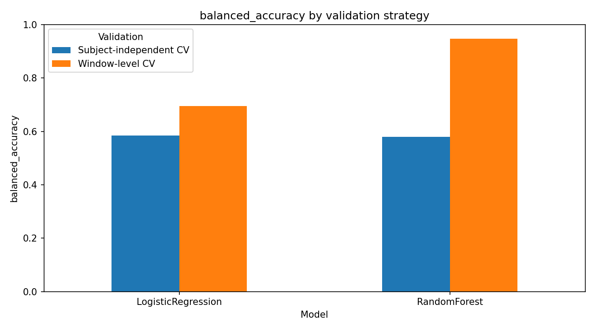
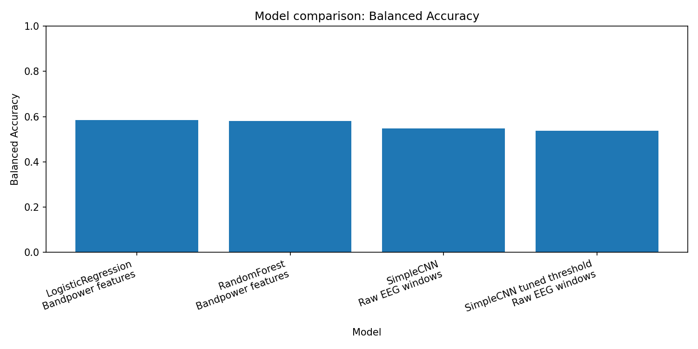
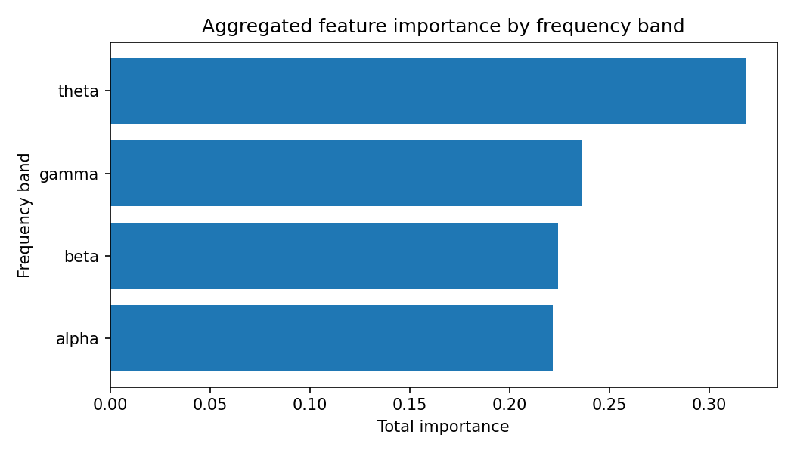
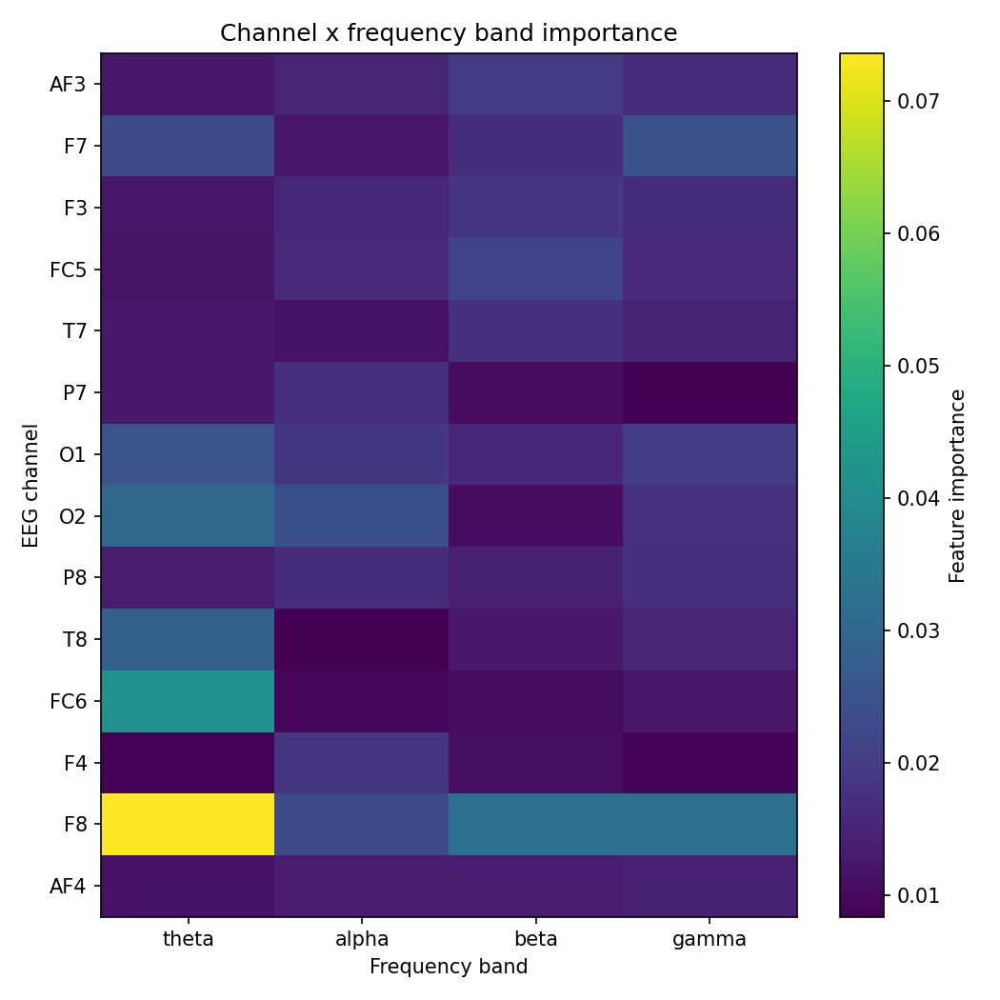

# EEG Cognitive Load Detection

EEG cognitive load detection project with classical machine learning baselines, subject-independent validation, CNN modeling, and a Streamlit demo.

This project is designed as a portfolio-ready neurotechnology / BCI case study. It demonstrates EEG preprocessing, spectral feature extraction, validation leakage analysis, model comparison, feature importance, and interactive model demonstration.

## Project Goal

The goal is to classify EEG windows into two cognitive load states:

- `0` — low cognitive load
- `1` — high cognitive load

The project compares two approaches:

- classical machine learning on spectral bandpower features;
- convolutional neural network modeling on raw EEG windows.

## Why This Project Matters

EEG classification can easily produce misleadingly high scores when windows from the same subject appear in both train and test sets.

This project explicitly compares:

- window-level cross-validation — optimistic validation that may contain subject leakage;
- subject-independent validation — more realistic validation where test subjects are unseen during training.

The main finding is that window-level validation strongly overestimates performance.

## Datasets

The project uses two versions of the STEW EEG workload dataset.

### Hugging Face STEW

Used for the first window-level baseline.

Characteristics:

- 28,512 EEG windows
- 14 EEG channels
- 256 time points per window
- sampling rate: 128 Hz
- binary labels: low / high cognitive load
- balanced classes

Input tensor shape:

```text
X.shape == (28512, 14, 256)
y.shape == (28512,)
```

### Kaggle STEW MAT Dataset

Used for subject-independent validation.

Raw shape:

```text
dataset.mat: (14, 19200, 45)
class_012.mat: (45, 1)
```

This means:

- 14 EEG channels
- 19,200 time points per subject
- 45 subjects
- 128 Hz sampling rate
- 150 seconds per subject recording

The signals were split into EEG windows:

- window size: 256 samples, 2 seconds
- step size: 64 samples, 0.5 seconds

## Methods

- EEG windowing
- Spectral bandpower feature extraction
- Classical ML baselines
- Subject-independent validation
- Validation leakage analysis
- Feature importance analysis
- CNN modeling on raw EEG windows
- Threshold tuning
- Streamlit demo application

## Project Structure

- `app/streamlit_app.py` — Streamlit demo application.
- `app/demo_samples.npz` — prepared demo samples for inference.
- `models/eeg_cnn_subject_split_binary.pt` — trained CNN model.
- `reports/` — metrics, comparisons, and result summaries.
- `reports/figures/` — visual results used in README and reports.
- `scripts/` — data preparation, training, evaluation, and comparison scripts.
- `src/data/` — dataset loading utilities.
- `src/features/` — EEG feature extraction utilities.
- `src/models/` — CNN architecture.
- `requirements.txt` — Python dependencies.

## Key Results

### Validation Strategy Comparison

Window-level validation produced much stronger metrics than subject-independent validation, confirming that EEG window-level splits can overestimate real-world performance.

Subject-independent validation is more realistic because the model is evaluated on unseen subjects.

### Classical ML Baseline

Classical ML models were trained using spectral bandpower features.

The analysis includes:

- accuracy;
- balanced accuracy;
- macro F1;
- ROC AUC;
- feature importance;
- band-level and channel-level interpretation.

### CNN Model

A CNN was trained on raw EEG windows using a subject-independent split.

The CNN result should be interpreted as an exploratory baseline rather than a production-grade model. The dataset is relatively small for deep learning, and the model requires better calibration and regularization.

## Key Visual Results

### Validation Strategy Comparison



### ML vs CNN Comparison



### EEG Band Importance



### Channel-Band Importance Heatmap



## Streamlit Demo

The project includes a Streamlit demo for model inference on prepared EEG samples.

Run demo:

```bash
streamlit run app/streamlit_app.py
```

Demo files:

- `app/streamlit_app.py`
- `app/demo_samples.npz`
- `models/eeg_cnn_subject_split_binary.pt`

## Installation

Create and activate virtual environment:

```bash
python -m venv .venv
```

Windows PowerShell:

```bash
.\.venv\Scripts\Activate.ps1
```

Install dependencies:

```bash
pip install -r requirements.txt
```

## Reproduce Results

Prepare Kaggle STEW windows:

```bash
python scripts/prepare_stew_kaggle.py
```

Train subject-independent ML baselines:

```bash
python scripts/train_group_baseline_binary.py
```

Train window-level baselines:

```bash
python scripts/train_kaggle_window_baseline_binary.py
```

Compare validation strategies:

```bash
python scripts/compare_validation_strategies.py
```

Train CNN:

```bash
python scripts/train_cnn_subject_split_binary.py
```

Tune CNN threshold:

```bash
python scripts/tune_cnn_threshold.py
```

Compare ML and CNN:

```bash
python scripts/compare_ml_and_cnn.py
```

Run demo:

```bash
streamlit run app/streamlit_app.py
```

## Limitations

- The CNN was evaluated on a single subject-independent split, not full cross-validation.
- The dataset is relatively small for deep learning.
- The CNN requires better calibration and regularization.
- The current project focuses on offline classification, not real-time inference.
- Results are intended for educational and portfolio purposes, not clinical use.

## Future Work

- Train CNN with subject-independent cross-validation.
- Add EEGNet-style architecture.
- Add probability calibration.
- Add more robust preprocessing.
- Improve the Streamlit demo.
- Add unit tests and CI checks.

## Tech Stack

- Python
- NumPy
- Pandas
- SciPy
- scikit-learn
- PyTorch
- Matplotlib
- Streamlit
- Hugging Face Datasets

## Resume Summary

Built an EEG cognitive load detection pipeline using spectral bandpower features and raw EEG CNN modeling. Implemented subject-independent validation, leakage analysis, feature importance visualization, threshold tuning, and an interactive Streamlit demo.

## License

This project is licensed under the MIT License.
